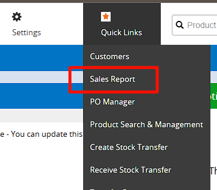
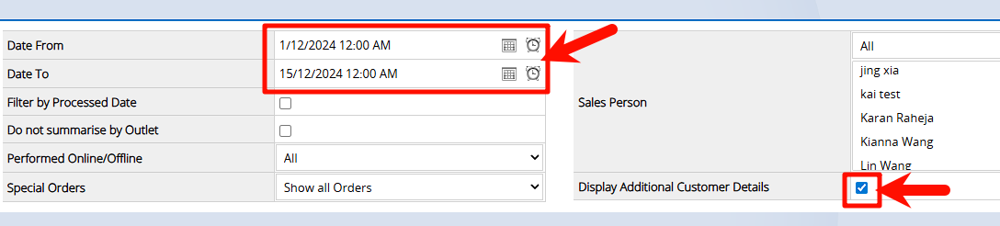
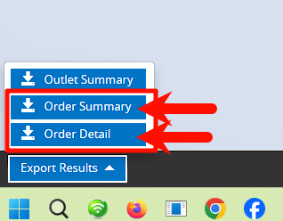
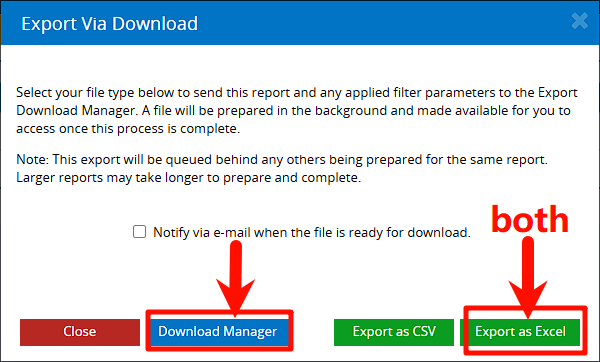
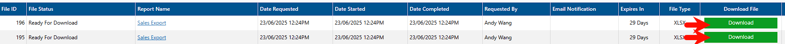

# 📘 How to Use the Order Merge Tool

---

### 🔹 Part 1: Export Files from Sale Report (RE system)

1. Go to **Sale Report**.
2. Select a **date range**, and make sure to **check the option "Display Customer Details"**. Then click **Search** at the bottom.
3. Click the export button at the bottom of the page.
4. A pop-up will appear (see example below). Click **"Export as Excel"**.
5. Do this for both **Order Summary** and **Order Detail** — export each one individually.
6. Next, click the **Download Manager** button. It will redirect to a new page (see example).
7. You’ll see the two files: one for **Order Summary**, and one for **Order Detail**. Download both files.

✅ This completes the export process from the RE system.

---

### 🔹 Part 2: Using the Program

8. Open the program. It may take a few seconds to fully load — please wait patiently.
9. Once the interface appears:
    - Upload **File 1** and **File 2** by selecting the two downloaded Excel files.
    - The order of upload does **not** matter.
    - Then click **"Start Merge"** to process the files.

✅ The merged file will be generated and available for download.

---

🛠 Developed by Andy Wang.  
Source code based on internal RE system as of Dec 2024.  
Documentation last updated: June 2025.
